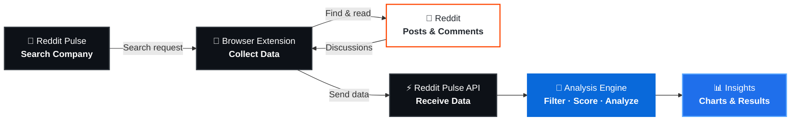
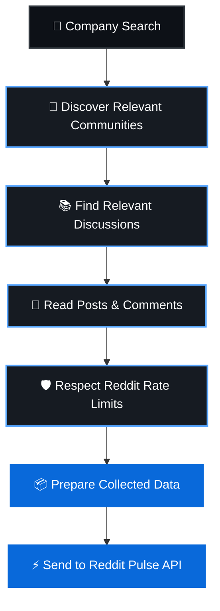
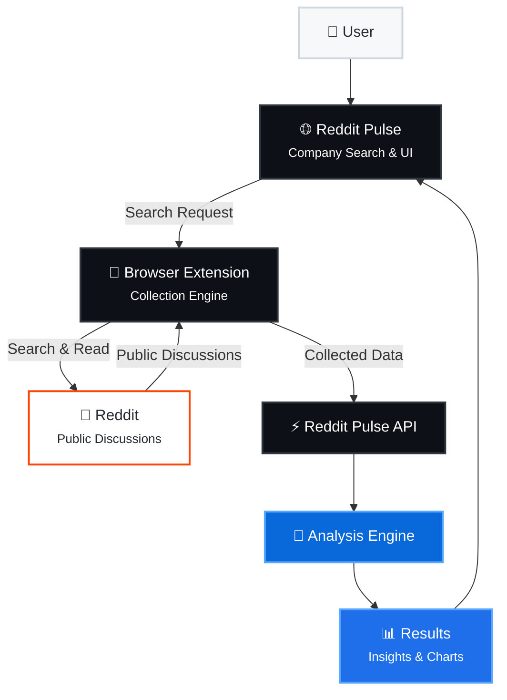

# Reddit Company Scraper

> A browser-based Reddit data collector for **Reddit Pulse** that lets you analyze real public Reddit discussions about companies — without requiring Reddit API keys.

<p align="center">
  <a href="https://reddit-scrapper-ncxc.onrender.com">
    <strong>Reddit Pulse</strong>
  </a>
  ·
  <a href="https://reddit-scrapper-ncxc.onrender.com/extension">
    Installation Guide
  </a>
</p>

---

## ✨ Overview

**Reddit Company Scraper** is the browser extension that powers Reddit data collection for Reddit Pulse.

Instead of relying on Reddit's API, the extension collects publicly accessible Reddit discussions **through the user's own browser session**.

This allows Reddit Pulse to search and analyze company discussions without requiring users to create or configure a separate Reddit API account.

---

## 🔄 How It Works

The complete process looks like this:



### In simple terms

**Search → Collect → Analyze → Understand**

The extension handles the Reddit collection while Reddit Pulse handles the processing and analysis.

---

## 🎯 Why Does This Exist?

Reddit does not allow a normal website to freely read Reddit discussions on a visitor's behalf.

The extension solves this by performing the collection **from the user's own browser**.

The user:

* Doesn't need a Reddit API key
* Doesn't need another Reddit account
* Doesn't need to manually copy Reddit discussions
* Can use their existing Reddit browser session

The extension acts as the bridge between Reddit and Reddit Pulse.

---

# 🔍 Data Collection Pipeline

When a user searches for a company, the extension follows a controlled collection process.



The extension:

1. Receives the company being searched.
2. Discovers relevant Reddit communities.
3. Finds relevant discussions.
4. Reads the discussions and comments.
5. Monitors Reddit's rate-limit information.
6. Controls request pacing when necessary.
7. Sends the collected information to Reddit Pulse.

---

# 🧠 Analysis Pipeline

Once the extension has collected the discussions, Reddit Pulse takes over.


The collected discussions are processed through several stages:

**Relevance → Scoring → LLM Analysis → Insights → Visualization**

This transforms raw Reddit discussions into information that can be used to understand how people are talking about a company.

---

# 📊 Collection Limits

A typical collection run:

| Metric             | Approximate Limit |
| ------------------ | ----------------: |
| 💬 Discussions     |               ~30 |
| 👥 Communities     |               ~10 |
| 🌐 Reddit Requests |             ≤ 120 |

The extension also monitors Reddit's rate-limit headers.

When Reddit indicates that requests should slow down, the extension automatically **paces or waits between requests** instead of continuously sending requests.

This makes the collection process more controlled and reduces unnecessary request bursts.

---

# 🚀 Installation

> **No programming experience is required.**

If you've never installed a browser extension manually before, follow these steps.

### 1. Download the Repository

Download this repository as a ZIP file and extract it somewhere on your computer.

### 2. Open Chrome Extensions

Open:

```text
chrome://extensions
```

### 3. Enable Developer Mode

Turn on **Developer mode** using the toggle in the top-right corner.

### 4. Load the Extension

Click:

**Load unpacked**

Then select the repository's:

```text
extension/
```

folder.

### 5. Sign in to Reddit

Make sure you are signed in to Reddit in the **same browser** where the extension was installed.

That's it.

The extension should now appear in your browser's extensions list.

---

# 🌐 Supported Browsers

The extension works with Chromium-based browsers, including:

* ✅ Google Chrome
* ✅ Microsoft Edge
* ✅ Brave
* ✅ Other Chromium-based browsers

Currently unsupported:

* ❌ Safari
* ❌ Firefox

---

# ⚙️ Configuration

After installing the extension:

1. Open your browser's extension menu.
2. Open **Reddit Company Scraper**.
3. Open the extension popup.
4. Find **Site address**.
5. Enter the Reddit Pulse instance you want the extension to send data to.

The default hosted instance is:

```text
https://reddit-scrapper-ncxc.onrender.com
```

This allows the same extension to connect to a different Reddit Pulse deployment if required.

---

# 🔐 Permissions & Privacy

The extension only requests access required for its functionality.

| Permission              | Purpose                                                          |
| ----------------------- | ---------------------------------------------------------------- |
| `old.reddit.com`        | Reading public Reddit posts and comments                         |
| Reddit Pulse app domain | Sending collected data and receiving search requests             |
| `storage`               | Caching community information and the status of the previous run |

### What the extension does **not** do

The extension:

* ❌ Does not post on Reddit
* ❌ Does not upvote or downvote
* ❌ Does not comment
* ❌ Does not send messages
* ❌ Does not access your Reddit password
* ❌ Does not read unrelated websites

It is designed specifically to collect publicly accessible Reddit discussions and send them to the connected Reddit Pulse application.

---

# 🏗️ Architecture

The extension sits between Reddit Pulse and Reddit.



---

# 📁 Project Structure

```text
extension/
│
├── background.js
├── bridge.js
├── popup.html
├── popup.js
└── manifest.json
```

### `background.js`

The main collection engine.

Handles:

* Reddit searching
* Discussion collection
* Request pacing
* Rate-limit handling
* Sending collected data to the API

### `bridge.js`

Acts as the communication layer between the Reddit Pulse webpage and the browser extension.

### `popup.html`

Defines the extension popup interface.

### `popup.js`

Handles:

* Extension status
* Site address configuration
* Popup interactions

### `manifest.json`

Defines:

* Extension configuration
* Required permissions
* Browser behavior
* Sites where the bridge can operate

---

# 🛠️ Tech Stack

Built using standard browser-extension technologies:

| Technology            | Purpose                    |
| --------------------- | -------------------------- |
| JavaScript            | Extension logic            |
| HTML                  | Extension UI               |
| Chrome Extension APIs | Browser integration        |
| Chromium APIs         | Browser compatibility      |
| Reddit                | Data source                |
| Reddit Pulse API      | Data transfer & processing |

---

# 📖 User Guide

For a beginner-friendly installation guide with explanations and visuals:

### 👉 [Open the Reddit Pulse Extension Guide](https://reddit-scrapper-ncxc.onrender.com/extension)

---

# 🔗 Reddit Pulse

The extension is designed to work with **Reddit Pulse**, the application responsible for processing, analyzing, and visualizing the collected Reddit discussions.

### 👉 [Open Reddit Pulse](https://reddit-scrapper-ncxc.onrender.com)

---

# ⚠️ Disclaimer

This project is intended for collecting and analyzing publicly accessible Reddit discussions.

Please use the extension responsibly and respect Reddit's terms, policies, and applicable usage limits.

---

<p align="center">
  Built to turn Reddit discussions into useful company insights.
</p>
